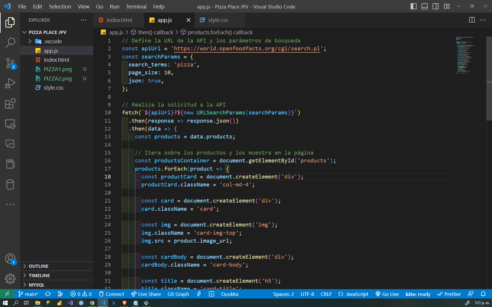

# Pizza-Place-JPV
Pizza Place JPV (HTML, CSS, Y BOOTSTRAP) Y API=  https://world.openfoodfacts.org/cgi/search.pl

El código es una solicitud de API que busca productos de comida que contengan la palabra "pizza" y muestra los resultados en una página web. Los productos se muestran en tarjetas con una imagen, título, descripción, precio y un enlace a la fuente.

La solicitud se realiza utilizando el método fetch de JavaScript y los resultados se manejan en formato JSON. Luego, se crea dinámicamente un conjunto de elementos HTML para cada producto encontrado y se agregan a la página utilizando el método appendChild.

El código es adecuado para un repositorio de GitHub que se centre en la integración de solicitudes de API en una página web y la manipulación dinámica de elementos HTML.

## CAPTURAS DE PANTALLA:

## CAPTURAS DE PANTALLA:

## CAPTURAS DE PANTALLA:

